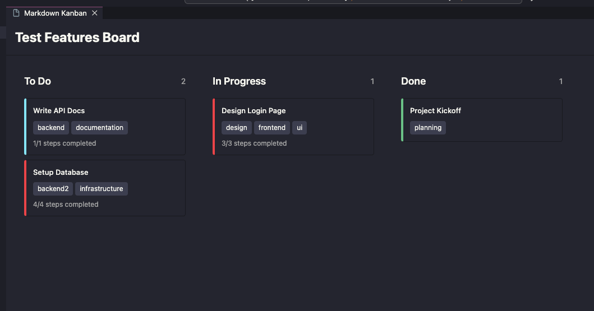

# Kanban.md

<div align="center">


**Transform your Markdown files into powerful, interactive Kanban boards**

[](https://marketplace.visualstudio.com/items?itemName=wguilherme.kanban-md)
[](https://code.visualstudio.com/)
[](LICENSE)

[Features](#-features) • [Installation](#-installation) • [Usage](#-usage) • [Contributing](#-contributing) • [Changelog](CHANGELOG.md)

</div>

---

## 📖 Overview

**Kanban.md** is a modern VSCode extension that brings the power of Kanban boards directly into your Markdown workflow. Manage tasks, track progress, and organize projects using plain Markdown files with a beautiful, interactive drag-and-drop interface.

Built with modern technologies (React 19, TypeScript 5.9, Vite 7) and designed to respect your VSCode theme, Kanban.md seamlessly integrates with your development environment.

> **Note**: This project is inspired by [holooooo/markdown-kanban](https://github.com/holooooo/markdown-kanban). It has been completely refactored with modern technologies and architectural patterns to provide enhanced performance and maintainability.



---

## ✨ Features

### 🎯 Core Functionality

- **📋 Markdown-First Approach**: Your data lives in `.kanban.md` files - no databases, no proprietary formats
- **🔄 Real-Time Bidirectional Sync**: Changes in the Kanban view instantly update the Markdown file and vice versa
- **🎨 Theme-Aware UI**: Automatically adapts to your VSCode theme (Dracula, One Dark Pro, etc.)
- **⚡ Smooth Drag & Drop**: Built with [@dnd-kit](https://dndkit.com/) for fluid, responsive interactions
- **🗂️ Sidebar Integration**: Dedicated Activity Bar icon with TreeView showing all kanban boards in your workspace

### 📝 Rich Task Management

- **Priority Levels**: Three levels - High (🔴), Medium (🟡), Low (🟢)
- **Workload Tracking**: Four intensity levels - Easy (🟢), Normal (🟡), Hard (🔴), Extreme (🔴🔴)
- **Step-by-Step Tasks**: Checkbox-based subtasks using `- [ ] step` format
- **Tag System**: Multiple tagging formats supported:
  - Inline: `#tag1 #tag2`
  - Array: `[tag1, tag2, tag3]`
- **Due Dates**: Track deadlines with `due:YYYY-MM-DD`
- **Task Descriptions**: Multi-line descriptions with Markdown code block support
- **Expand/Collapse**: Tasks collapsed by default for clean view

### 🔧 Advanced Features

- **Archive Support**: Move completed columns to archive state
- **Column Management**: Hide/show, reorder columns via drag & drop
- **Tag Filtering**: Filter tasks by one or multiple tags (comma-separated)
- **Multiple Sort Options**: Sort by name, due date, priority, workload
- **File Switcher**: Toggle automatic file switching behavior
- **Quick Board Creation**: One-click creation with pre-filled templates
- **Auto-Refresh**: Sidebar updates when `.kanban.md` files change
- **Configurable Task Format**: Choose between header (`###`) or list (`-`) format

### 🏗️ Technical Highlights

- **Modern Architecture**:
  - React 19 with functional components and hooks
  - TypeScript 5.9 with strict mode
  - Vite 7 for lightning-fast builds
  - TailwindCSS 3 for utility-first styling
- **Atomic Design Pattern**: Component structure (Atoms → Molecules → Organisms)
- **Optimistic UI Updates**: Instant visual feedback before backend confirmation
- **Collision Detection**: Smart `closestCorners` algorithm for accurate drop targeting

---

## 🚀 Installation

### From VSCode Marketplace

1. Open VSCode
2. Press `Ctrl+Shift+X` (Windows/Linux) or `Cmd+Shift+X` (Mac)
3. Search for **"Markdown Kanban"**
4. Click **Install**

### From VSIX

```bash
code --install-extension kanban-md-0.1.1.vsix
```

### Requirements

- **VSCode**: 1.74.0 or higher
- **Node.js**: 22+ (for development)

---

## 💡 Usage

### Quick Start

#### 1️⃣ Create a Kanban Board

**Option A: From Sidebar** (Recommended)

1. Click the Kanban icon in the Activity Bar (left sidebar)
2. Click the **➕ New Kanban Board** button
3. Enter a name (e.g., `sprint-planning`)
4. Board opens automatically with example tasks

**Option B: Manual Creation**

Create a file with `.kanban.md` extension:

```markdown
# Project Sprint

## To Do

### Design User Interface
#design #ui #frontend
**Priority:** High
**Workload:** Hard
**Due:** 2024-12-01

Design user login and registration pages, including:
- Responsive layout design
- Brand color application
- User experience optimization

- [ ] Create wireframes
- [ ] Design mockups
- [ ] Get stakeholder approval

### Write API Documentation
#documentation #backend
**Priority:** Medium
**Workload:** Normal

Write complete REST API documentation using OpenAPI 3.0 specification.

## In Progress

### Implement Authentication
#security #backend
**Priority:** High
**Workload:** Extreme

- [x] Setup JWT tokens
- [ ] Add OAuth providers
- [ ] Write security tests

## Done

### Project Setup
#setup
**Priority:** Low
**Workload:** Easy

Initial repository setup complete!
```

#### 2️⃣ Open Kanban View

Choose any method:

- **Method 1**: Click a board in the sidebar
- **Method 2**: Right-click `.kanban.md` file → **"Kanban"**
- **Method 3**: Command Palette (`Ctrl/Cmd+Shift+P`) → **"Markdown Kanban: Kanban"**

#### 3️⃣ Manage Tasks

**Moving Tasks**
- Drag any task card to another column
- Changes save automatically to the Markdown file

**Filtering & Sorting**
- Enter tags in the filter box: `design,urgent`
- Use sort dropdown: Name, Due Date, Priority, Workload
- Click "Clear Filters" to reset

**Task Operations**
- **Expand**: Click task to view full details
- **Edit**: Click "Edit" button on task card
- **Delete**: Click "Delete" button
- **Add**: Click "+ Add Task" at column bottom

**Column Operations**
- **Hide**: Click eye icon on column title
- **Reorder**: Drag column header to new position
- **Archive**: Mark columns as archived

---

## 🎨 Task Format Reference

### Supported Formats

**Modern Structured Format** (Recommended)

```markdown
### Task Title
- tags: [tag1, tag2, tag3]
- priority: high
- workload: Hard
- due: 2024-12-31
- defaultExpanded: true
- steps:
    - [x] Step 1
    - [ ] Step 2
  ```md
  Detailed description with **Markdown** support.
  Can include code blocks, lists, etc.
  ```
```

**Classic Inline Format** (Also Supported)

```markdown
### Task Title
#tag1 #tag2
**Priority:** High
**Workload:** Hard
**Due:** 2024-12-31

Task description here

- [ ] Step 1
- [x] Step 2
```

### Attribute Values

| Attribute | Values | Example |
|-----------|--------|---------|
| `priority` | `high`, `medium`, `low` | `priority: high` |
| `workload` | `Easy`, `Normal`, `Hard`, `Extreme` | `workload: Hard` |
| `due` | `YYYY-MM-DD` | `due: 2024-12-31` |
| `defaultExpanded` | `true`, `false` | `defaultExpanded: true` |
| `tags` | Array or hashtags | `[ui, design]` or `#ui #design` |

---

## ⚙️ Configuration

### Settings

Access via `File > Preferences > Settings` → Search "Markdown Kanban"

#### `markdown-kanban.taskHeader`

Choose task format in Markdown files:

- **`"title"`** (default): Tasks use `### Header` format
- **`"list"`**: Tasks use `- List item` format

```json
{
  "markdown-kanban.taskHeader": "title"
}
```

### Commands

| Command | Shortcut | Description |
|---------|----------|-------------|
| `Markdown Kanban: Kanban` | - | Open Kanban view for current file |
| `Markdown Kanban: New Kanban Board` | - | Create new kanban file |
| `Markdown Kanban: Refresh` | - | Refresh sidebar board list |
| `Markdown Kanban: Enable/Disable File Switcher` | - | Toggle automatic file switching |

---

## 🏗️ Development

### Prerequisites

```bash
node --version  # Should be 22+
npm --version
```

### Setup

```bash
# Clone repository
git clone https://github.com/wguilherme/kanban.md.git
cd kanban.md

# Install dependencies
npm install

# Build extension + webview
npm run build
```

### Development Workflow

```bash
# Watch mode (auto-rebuild on changes)
npm run watch

# Type checking
npm run check-types

# Linting
npm run lint

# Run tests
npm test
```

### Project Structure

```
markdown-kanban/
├── src/
│   ├── extension.ts              # Extension entry point
│   ├── kanbanWebviewPanel.ts     # Webview lifecycle manager
│   ├── webview/                  # React application
│   │   ├── App.tsx               # Main React app with DnD
│   │   ├── components/
│   │   │   ├── atoms/            # Atomic design: Button, Badge, Input, etc.
│   │   │   ├── DraggableTask.tsx
│   │   │   └── DroppableColumn.tsx
│   │   ├── hooks/                # Custom React hooks
│   │   └── types/                # TypeScript definitions
├── dist/                         # Build output
│   ├── extension.js              # Bundled extension
│   └── webview/                  # Bundled React app
├── vite.config.ts                # Vite config for extension
├── vite.webview.config.ts        # Vite config for webview
├── tailwind.config.js            # TailwindCSS with VSCode theme vars
└── tsconfig.json                 # TypeScript configuration
```

### Build System

This project uses **Vite 7** with dual configurations:

- **Extension**: Node.js SSR build (`vite.config.ts`)
- **Webview**: Browser SPA build (`vite.webview.config.ts`)

### Key Technologies

| Technology | Version | Purpose |
|------------|---------|---------|
| TypeScript | 5.9.3 | Type-safe development |
| React | 19.2.0 | UI framework |
| Vite | 7.2.4 | Build tool |
| TailwindCSS | 3.4.18 | Styling |
| @dnd-kit | 6.3.1 | Drag & drop |
| VSCode API | 1.106.1 | Extension integration |

---

## 🤝 Contributing

We welcome contributions! Whether it's bug reports, feature requests, or pull requests, your input helps make Markdown Kanban better.

### How to Contribute

1. **Fork the repository**
   ```bash
   gh repo fork wguilherme/kanban.md
   ```

2. **Create a feature branch**
   ```bash
   git checkout -b feature/amazing-feature
   ```

3. **Make your changes**
   - Write clean, typed TypeScript code
   - Follow the Atomic Design pattern for components
   - Add tests if applicable
   - Update documentation

4. **Test thoroughly**
   ```bash
   npm run check-types
   npm run lint
   npm run build
   # Manual testing in VSCode
   ```

5. **Commit with clear messages**
   ```bash
   git commit -m "feat: add task duplication feature"
   ```

6. **Push and create PR**
   ```bash
   git push origin feature/amazing-feature
   gh pr create
   ```

### Contribution Guidelines

- **Code Style**: Follow existing patterns, use TypeScript strict mode
- **Commit Messages**: Use [Conventional Commits](https://www.conventionalcommits.org/)
  - `feat:` New features
  - `fix:` Bug fixes
  - `docs:` Documentation changes
  - `refactor:` Code refactoring
  - `chore:` Build/tooling changes
- **Testing**: Ensure no regressions before submitting
- **Documentation**: Update README/CHANGELOG for user-facing changes

### Development Tips

- Use **React DevTools** for debugging webview components
- Check `Output > Markdown Kanban` for extension logs
- Test with multiple VSCode themes to ensure UI compatibility
- Verify `.kanban.md` file sync works bidirectionally

### Areas for Contribution

- 📱 Mobile/responsive improvements
- 🎨 Additional theme customization options
- 🔍 Advanced search/filter capabilities
- 📊 Task analytics and reporting
- 🌐 i18n/localization support
- 🧪 Test coverage expansion
- 📝 Documentation improvements

---

## 🐛 Bug Reports

Found a bug? Please [open an issue](https://github.com/wguilherme/kanban.md/issues/new) with:

- **VSCode version**: `Help > About`
- **Extension version**: Check extensions panel
- **OS**: Windows/macOS/Linux + version
- **Steps to reproduce**: Detailed repro steps
- **Expected vs actual behavior**
- **Screenshots/GIFs**: If applicable
- **Sample `.kanban.md` file**: If relevant

---

## 💬 Support

- **Issues**: [GitHub Issues](https://github.com/wguilherme/kanban.md/issues)
- **Discussions**: [GitHub Discussions](https://github.com/wguilherme/kanban.md/discussions)
- **Marketplace**: [VSCode Marketplace](https://marketplace.visualstudio.com/items?itemName=wguilherme.markdown-kanban)

---

## 📜 License

This project is licensed under the **MIT License** - see the [LICENSE](LICENSE) file for details.

---

## 🙏 Acknowledgments

- Built with [VSCode Extension API](https://code.visualstudio.com/api)
- Drag & drop powered by [@dnd-kit](https://dndkit.com/)
- UI components follow [Atomic Design](https://atomicdesign.bradfrost.com/) principles
- Special thanks to all [contributors](https://github.com/wguilherme/kanban.md/graphs/contributors)

---

## 📊 Project Stats


---

<div align="center">

**Made with ❤️ by the open source community**

[⬆ Back to top](#kanbanmd)

</div>
